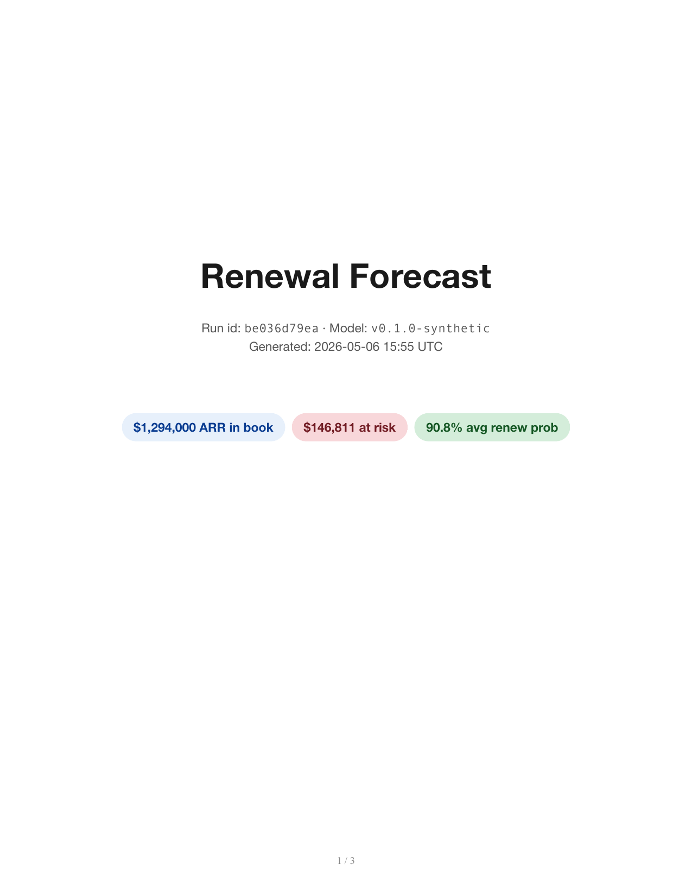
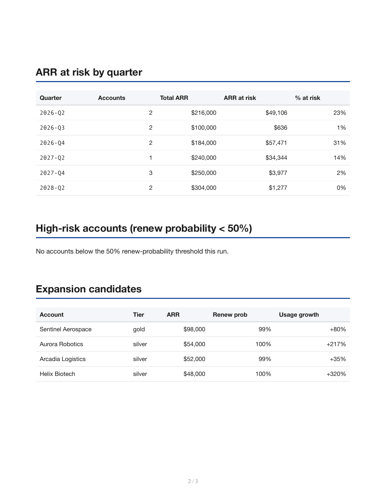
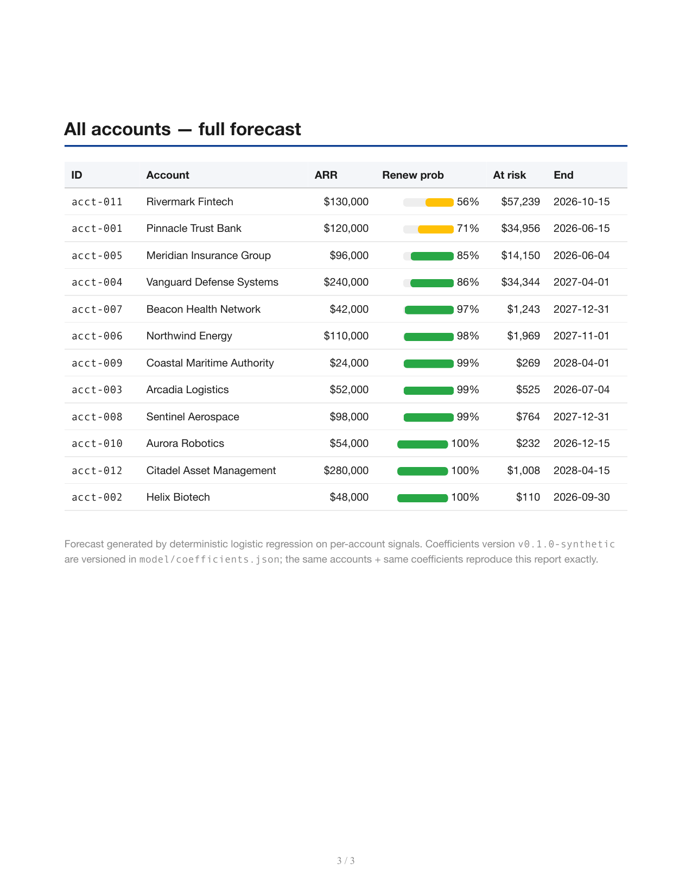

# renewal-forecasting-agent

[](https://github.com/anthonyonazure/renewal-forecasting-agent/actions/workflows/tests.yml)
[](https://www.python.org/)
[](LICENSE)

Per-account renewal probability + ARR-at-risk forecasting using **deterministic logistic regression** on the same signals AAM already collects. Emits a board-grade PDF: total ARR, at-risk dollars, by-quarter pipeline, high-risk and expansion-candidate lists.

## Why deterministic, not LLM-scored

Renewal probability is the kind of math you have to defend in a QBR. The number has to be reproducible from the inputs and the model version, and a CFO needs to be able to ask "why is Acme at 56%?" and get an itemized answer. The model returns a `contributions` map per account showing exactly which features pushed the probability up or down — no LLM in the scoring loop.

The LLM is only used (optionally) for the **executive narrative** in the PDF.

## Architecture

```
load_inputs (accounts.yaml + coefficients.json)
       │
       ▼
score_all (per-account logistic regression — pure Python)
       │
       ▼
summarize (aggregate ARR-at-risk, by-quarter, high-risk + expansion lists)
       │
       ▼
build_pdf (Jinja2 + WeasyPrint, with prob bars + contribution rows)
```

## Sample forecast PDF

<p>
  
  
  
</p>

## Quick start

```bash
cd ../b2b-agent-toolkit && pip install -e ".[dev]" && cd -
pip install -e ".[dev]"

renewal run                          # runs against accounts/sample.yaml
renewal run --accounts /path/to/accounts.yaml --coefficients /path/to/coeffs.json
```

12 demo accounts in `accounts/sample.yaml` map 1:1 to the [ai-account-manager](https://github.com/anthonyonazure/ai-account-manager) seed (Pinnacle silent churn, Rivermark combined risk, Citadel power user). The model correctly ranks them in that order.

## What the model uses

| Feature | Coefficient (logit) | Notes |
|---|---|---|
| `engagement_decay` | -3.2 | strongest negative — silent churn signal |
| `avg_csat_3mo` | +0.45 / point | each CSAT point +1.6× odds |
| `p1_count_30d` | -0.30 / incident | high-severity ticket pressure |
| `usage_growth_pct / 100` | +0.50 | sticky factor |
| `module_gap_count` | -0.40 / module | unused features = churn risk |
| `exec_sponsor_present` | +0.85 | political durability |
| `previous_renewal_count` | +0.55 / renewal | habit forms |
| `contract_months_in` | -0.005 / month | very mild fatigue |

Coefficients live in [`model/coefficients.json`](model/coefficients.json) — versioned, diffable, audit-trail-included in every forecast. In production, replace with weights trained on your historical renewal data; the rest of the pipeline stays the same.

## Layout

```
accounts/sample.yaml          # 12 demo accounts
model/coefficients.json       # versioned logistic-regression weights
src/renewal/
├── model.py                  # pure-Python logistic scorer + sigmoid
├── forecast.py               # ARR-at-risk aggregation + by-quarter rollup
├── state.py / graph.py / nodes.py   # LangGraph: load → score → aggregate → pdf
└── cli.py                    # `renewal run`
templates/forecast.html       # WeasyPrint forecast template
```
